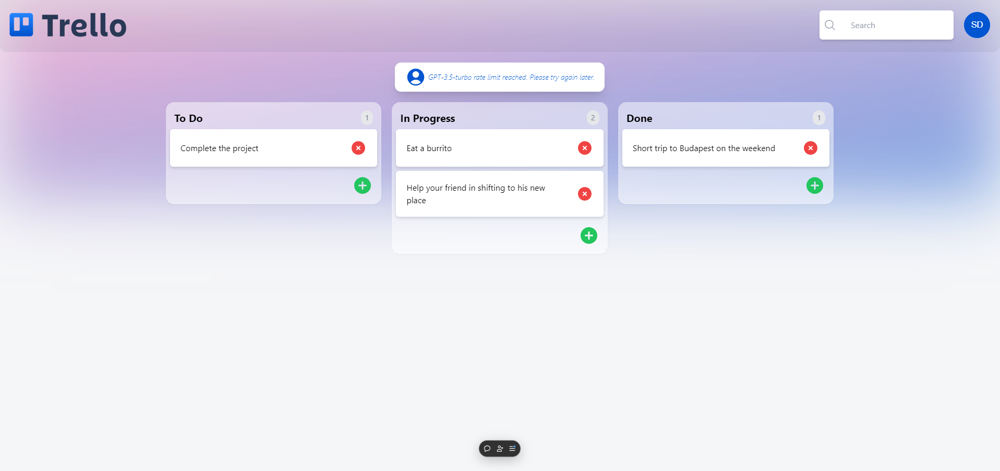

# Trello 2.0 built using NEXT JS, Tailwind CSS, Drag&Drop library, Zustand, Appwrite cloud and GPT-3.5-turbo:-

This is a clone of Trello, a popular task management application

# What i learnt in this project:-
1) Better understanding of web development using Next JS and Tailwind.
2) Implementing Drag & Drop library functionality.
3) Implementing Zustand for state management.
4) Working with the realtime database provided by Appwrite Cloud.
5) Use of headless-ui components.  


# Live version of the app:- [Link](https://trello-clone-raven1233-raven1233s-projects.vercel.app/)

# Screenshots of the app:-
<p><b>Landing Page:-</b></p>



# Next.js + Tailwind CSS Example

This example shows how to use [Tailwind CSS](https://tailwindcss.com/) [(v3.0)](https://tailwindcss.com/blog/tailwindcss-v3) with Next.js. It follows the steps outlined in the official [Tailwind docs](https://tailwindcss.com/docs/guides/nextjs).

## Preview

Preview the example live on [StackBlitz](http://stackblitz.com/):

[](https://stackblitz.com/github/vercel/next.js/tree/canary/examples/with-tailwindcss)

## Deploy your own

Deploy the example using [Vercel](https://vercel.com?utm_source=github&utm_medium=readme&utm_campaign=next-example):

[](https://vercel.com/new/git/external?repository-url=https://github.com/vercel/next.js/tree/canary/examples/with-tailwindcss&project-name=with-tailwindcss&repository-name=with-tailwindcss)

## How to use

Execute [`create-next-app`](https://github.com/vercel/next.js/tree/canary/packages/create-next-app) with [npm](https://docs.npmjs.com/cli/init) or [Yarn](https://yarnpkg.com/lang/en/docs/cli/create/) to bootstrap the example:

```bash
npx create-next-app --example with-tailwindcss with-tailwindcss-app
# or
yarn create next-app --example with-tailwindcss with-tailwindcss-app
```

Deploy it to the cloud with [Vercel](https://vercel.com/new?utm_source=github&utm_medium=readme&utm_campaign=next-example) ([Documentation](https://nextjs.org/docs/deployment)).